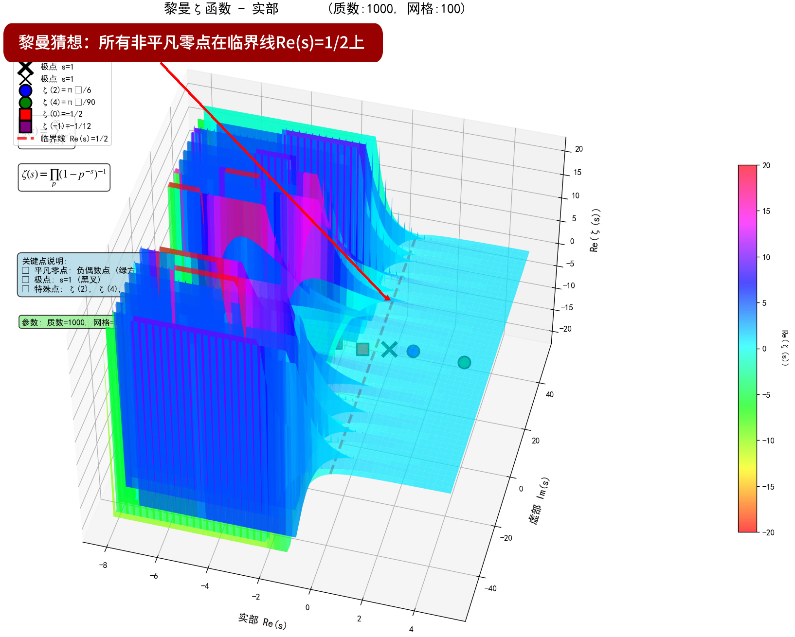
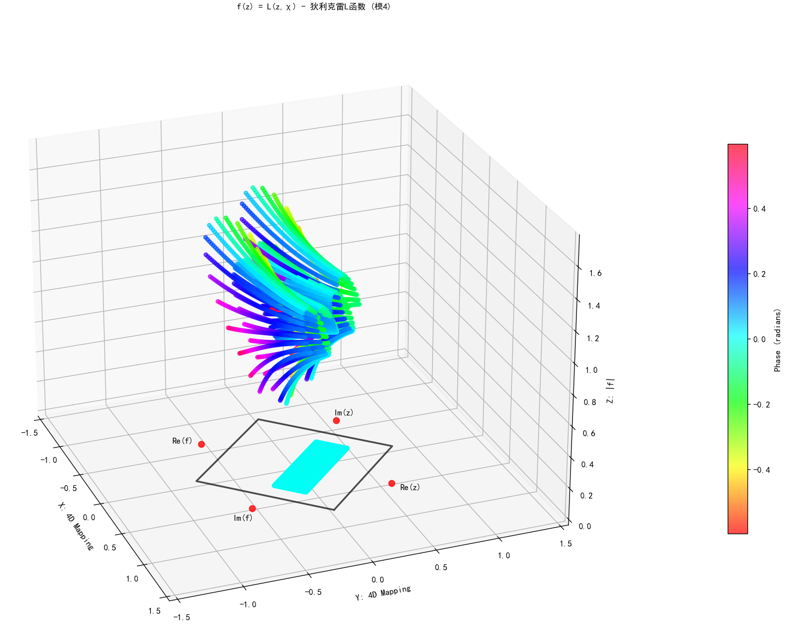

# 黎曼猜想证明（2026-02-03 02:13）最新版

[黎曼猜想证明nichuangao_all20260203am0144_utc+8_2.rar](https://github.com/ni-chuangao/mathematical-conjecture-proof/blob/master/%E9%BB%8E%E6%9B%BC%E7%8C%9C%E6%83%B3%E8%AF%81%E6%98%8Enichuangao_all20260203am0144_utc%208_2.rar)

[黎曼猜想证明nichuangao_all20260203am0144_utc 8_2.rar_可信时间戳认证证书.pdf](https://github.com/ni-chuangao/mathematical-conjecture-proof/blob/master/%E9%BB%8E%E6%9B%BC%E7%8C%9C%E6%83%B3%E8%AF%81%E6%98%8Enichuangao_all20260203am0144_utc%208_2.rar_%E5%8F%AF%E4%BF%A1%E6%97%B6%E9%97%B4%E6%88%B3%E8%AE%A4%E8%AF%81%E8%AF%81%E4%B9%A6.pdf)

# 黎曼猜想证明（2026-01-29 22:20）
[一种基于函数的黎曼猜想证明_3ok.rar](https://github.com/ni-chuangao/mathematical-conjecture-proof/blob/master/%E4%B8%80%E7%A7%8D%E5%9F%BA%E4%BA%8E%E5%87%BD%E6%95%B0%E7%9A%84%E9%BB%8E%E6%9B%BC%E7%8C%9C%E6%83%B3%E8%AF%81%E6%98%8E_3ok.rar)

[一种基于函数的黎曼猜想证明_3ok.rar_可信时间戳认证证书.pdf](https://github.com/ni-chuangao/mathematical-conjecture-proof/raw/master/%E4%B8%80%E7%A7%8D%E5%9F%BA%E4%BA%8E%E5%87%BD%E6%95%B0%E7%9A%84%E9%BB%8E%E6%9B%BC%E7%8C%9C%E6%83%B3%E8%AF%81%E6%98%8E_3ok.rar_%E5%8F%AF%E4%BF%A1%E6%97%B6%E9%97%B4%E6%88%B3%E8%AE%A4%E8%AF%81%E8%AF%81%E4%B9%A6.pdf)

 

 **密码后面公布** 

# 数学猜想证明

#### 介绍

用于数学猜想证明及代码等文档存储，本文档及目录下是预印本，尚未经过同行评审。

其内容仅代表作者观点，可能会有所修改。

这些论文经过初步的学术自审，未经严格的同行评审，但发布后本平台实行开放的后评议。

作者在预印本发布的成果再在学术期刊上发表，二者不构成重复发表。

会先上传加密压缩包，后面公布密码。

